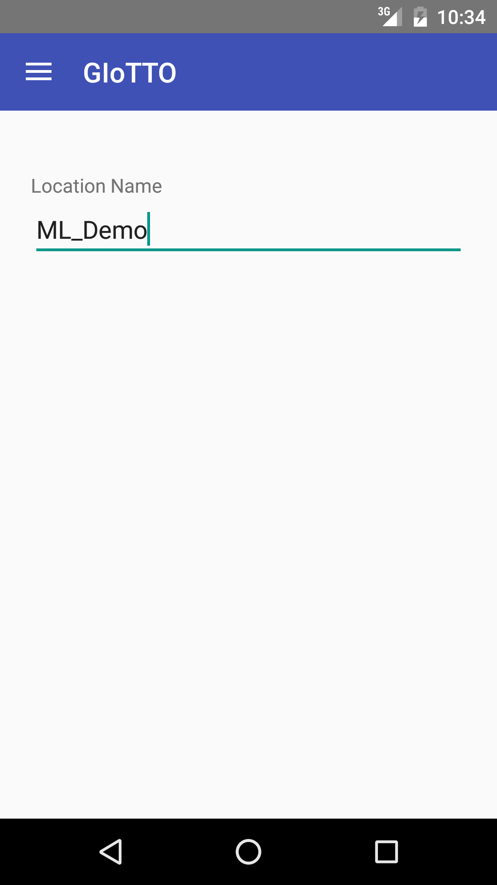
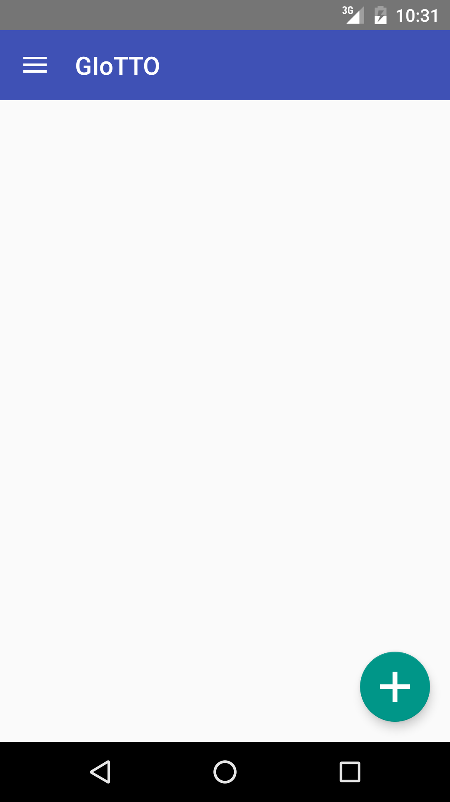
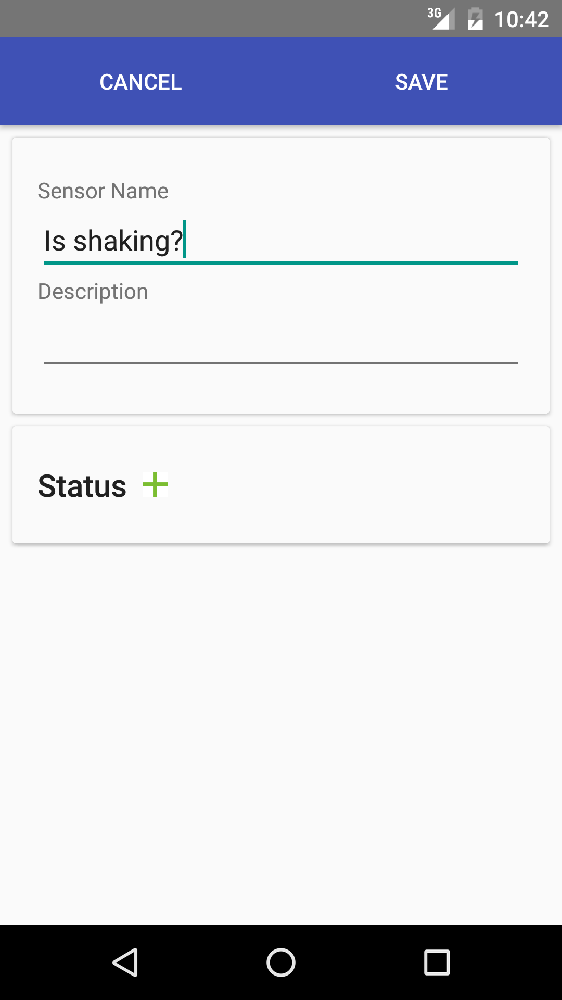
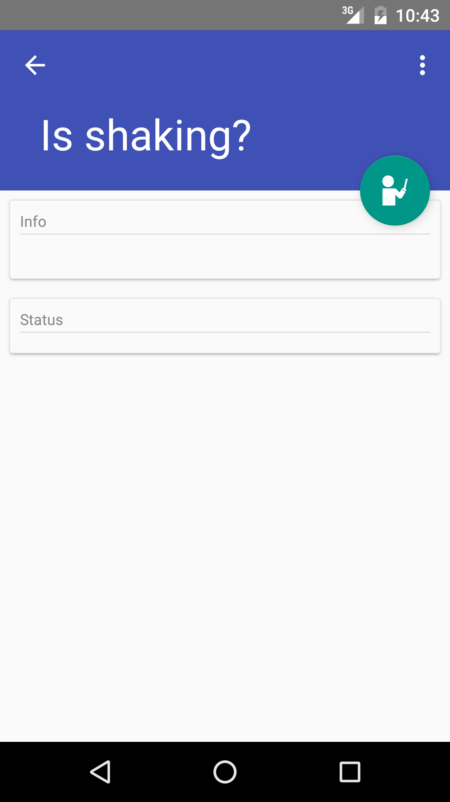
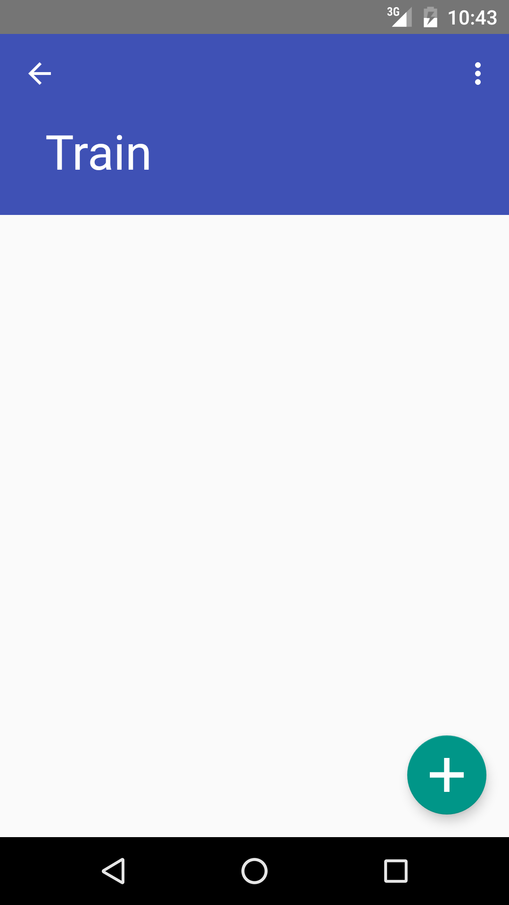

================
Usage
================

Set Location
--------------

In our vision, a ML front end should identify its location with localization technologies
such as BLE beacons or GPS.
However, because they are not deployed yet, we need to configure location manually.

Tap the hamburger icon at the top left corner and choose *Location*.
Then, put a location name.
The location name should match *location* meta tag attached to sensors in Building Depot.
If you are using the demo database in Building Depot, you can configure *ML_demo_room1*
for test.

Create a Virtual Sensor
------------------------

Go back to the main screen by tapping *Sensors* in the navigation drawer.
Tap + button to create a virtual sensor.
Type a name and a description and tap *Save*.
You can add *Status* later. So, let's skip it for now.

Add Training Samples
------------------------

Tap the virtual sensor that you just created from the sensor list.
Tap the teacher button to open *Train* screen.
Add Statuses (i.e., labels) by tapping + button.
For each status, record sensors readings. Tap recording button when your target is
in the state. For instance, if you want to create door oepn/close sensor.
You statuses would be open and close. First, open the door and tap recording button
for the open status, wait for a while, and tap *Finish*. Then, close the door,
and repeat the same process for the close status

You need to add at least five recordings to each status.

Train and Predict
-------------------
After adding training sample, tap *Train* menu in the top right corner
to train a virtual sensor.
Tap *Test* to obtain a prediction for the current status.

